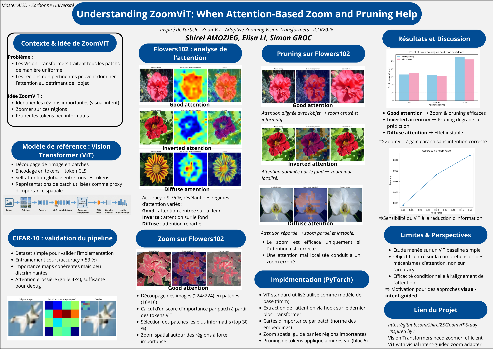

# ZoomViT : Intent-Guided Adaptive Processing for Vision Transformers

<p align="center">
  
</p>

---

This repository contains a **study and implementation** of the concepts introduced in the paper:

> **Vision Transformers Need Zoomer: Efficient ViT with Visual Intent-Guided Zoom Adapter**  
> *(Anonymous, 2026)*

The goal of this project is to **experimentally validate the core hypothesis of ZoomViT**:  
**Vision Transformers perform better and more efficiently when their visual intent is guided toward class-decisive regions.**

---

## 1. Project Motivation

Standard Vision Transformers (ViTs) process images using **uniform, fixed-size patches**, which often leads to:

- **Redundancy**: Background pixels are processed with the same computational cost as the main subject.
- **Misalignment**: The model’s attention can be *hijacked* by visually salient but class-irrelevant objects  
  (e.g., leaves instead of a flower).

ZoomViT proposes a **bio-inspired mechanism** that simulates *foveal vision*, allocating higher resolution and computational focus to semantically important regions.

---

## 2. Dataset Strategy

To properly study visual intent and spatial importance, two datasets were used:

- **CIFAR-10**  
  Used for initial pipeline validation and fast training of the baseline ViT.

- **Oxford Flowers-102**  
  Used as the **primary dataset** for Zoom and Pruning analysis.  
  Its higher resolution (224×224) enables interpretable spatial importance maps, which are otherwise too coarse on low-resolution datasets such as CIFAR-10.

This dataset choice was critical to meaningfully analyze visual intent alignment.

---

## 3. Implementation Pipeline

### Step 1: Baseline Vision Transformer

A Vision Transformer baseline built upon the **timm** PyTorch implementation, extended with custom hooks and pruning mechanisms.

The architecture includes:

- Patch Embedding and Positional Encodings  
- 12 Transformer blocks with Multi-Head Self-Attention  
- Supervised training to establish a reference **visual intent baseline**

This baseline serves as the anchor point for all subsequent comparisons.

---

### Step 2: Visual Intent Extraction (Importance Maps)

Instead of reproducing the full Zoomer distillation framework, this project uses **attention-based hooks** as a proxy for visual intent.

Attention representations are extracted from the final Transformer block, and patch-level importance scores are computed using the L2 norm of token embeddings.

These scores are reshaped into spatial **Importance Maps** highlighting regions that strongly contribute to the model’s internal representations.

This approximation preserves the *intent-guided philosophy* of ZoomViT while remaining computationally tractable.

---

### Step 3: Adaptive Actions (Zoom & Pruning)

This project primarily validates **Stage 2** of the ZoomViT paper through two adaptive mechanisms:

1. **Image-Level Zoom (Stage 1 : Simulation)**  
   Images are dynamically cropped and resized based on the bounding box extracted from importance maps.

2. **Token-Level Pruning (Stage 2 : Architectural Modification)**  
   - The token sequence is pruned **after the 6th Transformer block**.
   - Only the top *X% most important tokens* (tokens with the highest embedding magnitude) are retained.
   - The remaining Transformer blocks **recompute global attention exclusively on relevant tokens**.

This approach modifies the effective attention computation in later layers without retraining the model.

---

## Experimental Setup

- **Model**: ViT-Tiny (timm implementation)  
- **Dataset**: Oxford Flowers-102 (224×224 resolution)  
- **Training**: 5 epochs, cross-entropy loss, Adam optimizer  
- **Baseline Accuracy**: 9.76% (Top-1)

This baseline serves as the reference point for all pruning and zoom experiments.

---

## 4. Key Results & Analysis

The experiments reveal three behaviors described in the original paper:

### Qualitative Behavior Analysis

The following analysis is conducted with a fixed token retention ratio of **0.3**.

- **Good Alignment**  
  When the model correctly identifies the subject, pruning background tokens often *increases confidence* by removing **negative tokens**.

- **Inverted Intent**  
  When the model’s visual intent is misaligned (focused on background), pruning reinforces the error, illustrating the **Visual Intent Misalignment** phenomenon.

- **Diffuse Intent**  
  When the model is uncertain, importance maps are scattered. In this case, pruning slightly reduces confidence due to loss of contextual cues.

These results empirically confirm that **pruning is beneficial only when visual intent is correctly aligned**.
While this analysis focuses on a moderate pruning regime (0.3), a broader multi-ratio evaluation is presented below.

### Quantitative Token Retention Analysis

To evaluate structural robustness, we conducted a **post-hoc token pruning study** using multiple retention ratios:

- **0.1** (aggressive pruning)
- **0.3** (moderate pruning)
- **0.5** (light pruning)

#### Observations

- Classification accuracy **decreases** as the retention ratio decreases.
- Aggressive pruning significantly degrades performance.
- Prediction confidence remains relatively stable despite information loss.

This quantitative analysis demonstrates that post-hoc pruning reveals the **structural sensitivity** of Vision Transformers to token sparsification, reinforcing the need for **intent-guided adaptive mechanisms** such as ZoomViT.

The corresponding accuracy and token-retention curves are available in the `5_pruning_analysis` directory.

---

## 5. Repository Structure

```text
.
├── code/
│   ├── datasets/
│   │   ├── cifar.py
│   │   └── flowers.py
│   │
│   ├── models/
│   │   └── vit_baseline.py
│   │
│   ├── cifar_train.py
│   ├── cifar_evaluate.py
│   ├── cifar_analysis_attention.py
│   │
│   ├── flowers_train.py
│   ├── flowers_evaluate.py
│   ├── flowers_analysis_attention.py
│   ├── flowers_zoom_image.py
│   ├── flowers_token_pruning.py
│   ├── flowers_pruning_plot.py
│   │
│   ├── flowers_pruning_analysis.py
│   │
│   └── utils.py
│
├── experiments/
│   ├── cifar/
│   │   └── vit_baseline/
│   │       ├── visualizations/
│   │       └── results.txt
│   │
│   └── flowers/
│       └── vit_baseline/
│           ├── 1_visualizations/
│           │   ├── 1_good_attention/
│           │   ├── 2_inverted_attention/
│           │   └── 3_diffuse_attention/
│           │
│           ├── 2_zoom_image/
│           │   ├── 1_good_attention/
│           │   ├── 2_inverted_attention/
│           │   └── 3_diffuse_attention/
│           │
│           ├── 3_image_level_zoom/
│           │   ├── 1_good_attention/
│           │   ├── 2_inverted_attention/
│           │   └── 3_diffuse_attention/
│           │
│           ├── 4_token_pruning/
│           │   ├── pruning_confidence_plot.png
│           │   ├── pruning_results.txt
│           │
│           ├── 5_pruning_analysis/
│           │   ├── accuracy_vs_ratio.png
│           │   ├── confidence_vs_ratio.png
│           │   ├── tokens_vs_ratio.png
│           │   ├── pruning_results.txt
│           │
│           └── results.txt
│
├── docs/
│   └── 01_paper_summary.md
│   └── 02_poster.png
│
├── Paper_6623_Vision_Transformers_Need.pdf
├── .gitignore
└── README.md

```

---

## 6. Conclusion

This project bridges the gap between research theory and practical implementation.

By simplifying the ZoomViT adapter while preserving its core principles, we empirically demonstrate that selective attention is not merely an efficiency mechanism, but a structural robustness factor in Vision Transformers.

Through qualitative intent analysis (Good, Inverted, Diffuse attention) and quantitative multi-ratio pruning experiments, we show that:

- Pruning improves predictions only when visual intent is correctly aligned.
- Misaligned attention amplifies errors under token sparsification.
- Post-hoc pruning exposes the structural sensitivity of ViT models to information loss.

These findings support the central hypothesis of ZoomViT:  
**efficient and reliable Vision Transformers require explicit visual-intent guidance.**
